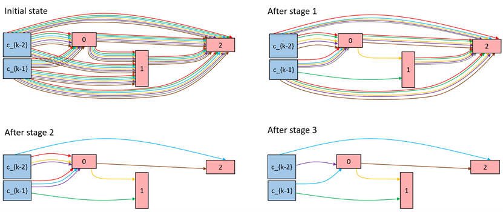

# EGASII: Efficient Graph Architecture Search with Initial Residual and Identity Mapping

[[Paper]]()

## Overview
Recently, Graph Convolutional Network (GCN) studies are trying to overcome the over-smoothing problem to get a deeper graph network, and the computational cost and memory usage of GCN is increasing. This paper, EGASII, uses Neural Architecture Search (NAS) to derive an efficient GCN architecture automatically. Initial residual and identity mapping is added to the candidate operations, and EGASII tries to find the combination and connection of these candidate operations to derive an architecture with better accuracy. This NAS method could find efficient architecture with better accuracy under the same model size, and inference time is also improved.

<p align="center">
  
</p>

## Requirements
* Pytorch 1.8.0
* CUDA 10.2
* torch-cluster 1.5.9
* torch-geometric 1.6.3
* torch-scatter 2.0.6
* torch-sparse 0.6.9
* torch-spline-conv 1.2.1
* numpy 1.19.2

## Citation
Please cite our paper if you find anything helpful,
```

```

## Acknowledgement
This code is modified from [SGAS](https://github.com/lightaime/sgas), and borrowed from [PDARTS](https://github.com/chenxin061/pdarts) and [GCNII](https://github.com/chennnM/GCNII).

## Contact
bryan07270@gmail.com
