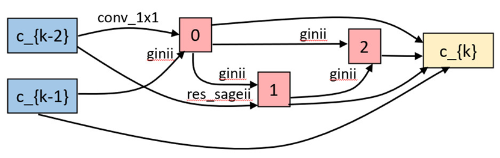

# EGASII on [PPI Dataset](https://arxiv.org/abs/1707.04638)
All experiments are done on single RTX 2080TI.

Best derived architecture:
<p align="center">
  
</p>

### Search 
``` 
python train_search.py --use_history --random_seed --data ../../data --batch_size 2
```

Just need to set `--data` into your desired data folder, dataset will be downloaded automatically.

### Train
For training the best architecture (`genotype_ii2`, `PPI_Best`) with 5 cells and 512 filters, run:
``` 
python main_ppi.py --phase train --arch PPI_Best --num_cells 5 --init_channels 512 --data ../../data/ppi --batch_size 2 --fix_drop_path_prob --epochs 8000 --disable_scheduler --learning_rate 0.0015
```
For training the best architecture (`genotype_ii2`, `PPI_Best`) with 3 cells and 256 filters, run:
``` 
python main_ppi.py --phase train --arch PPI_Best --num_cells 3 --init_channels 256 --data ../../data/ppi --batch_size 2 --fix_drop_path_prob --epochs 8000 --disable_scheduler --learning_rate 0.0015
```
Set `--arch` to any architecture you want. (One can find more architectures from `genotyps.py`) 

