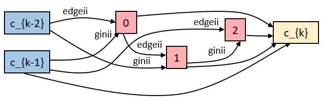

# EGASII on point clouds 
## Point Clouds Classification on [ModelNet](https://modelnet.cs.princeton.edu/)
All experiments are done on single RTX 2080TI.

Best derived architecture:
Best derived architecture:
<p align="center">
  
</p>

### Search 
``` 
python train_search.py --use_history --random_seed --data ../../data --batch_size 20
```

Just need to set `--data` into your desired data folder, ModelNet10 dataset will be downloaded automatically.

### Train
For training the best architecture with 3 cells, 128 filters and k nearest neighbors 9, run:
```
python main_modelnet.py --phase train --arch ModelNet_Best --num_cells 3 --init_channels 128 --k 9 --save modelnet40_best_l3_c128_k9 --fixed_drop_path_prob --epochs 600
```
For training the best architecture with 2 cells, 128 filters and k nearest neighbors 9, run:
```
python main_modelnet.py --phase train --arch ModelNet_Best --num_cells 2 --init_channels 128 --k 9 --save modelnet40_best_l2_c128_k9 --fixed_drop_path_prob --epochs 600
```
For training the best architecture with 3 cells, 64 filters and k nearest neighbors 9, run:
```
python main_modelnet.py --phase train --arch ModelNet_Best --num_cells 3 --init_channels 64 --k 9 --save modelnet40_best_l3_c64_k9 --fixed_drop_path_prob --epochs 400 --batch_size 48
```
For training the best architecture with 2 cells, 64 filters and k nearest neighbors 9, run:
```
python main_modelnet.py --phase train --arch ModelNet_Best --num_cells 2 --init_channels 64 --k 9 --save modelnet40_best_l2_c64_k9 --fixed_drop_path_prob --epochs 400 --batch_size 56
```
Just need to set `--data` into your data folder, dataset ModelNet40 will be downloaded automatically.  
Set `--arch` to any architecture you want. (One can find more architectures from `genotyps.py`) 

